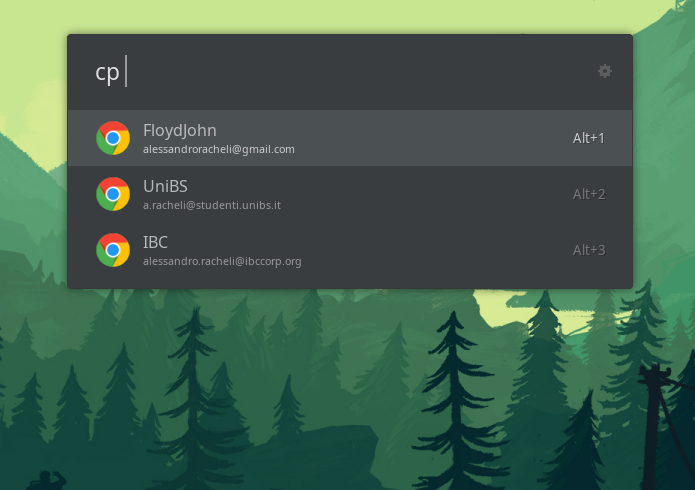

# Chrome Profiles

Ulauncher extension to open Google Chrome using a chosen user profile.

## Preview



## Requirements

- [Ulauncher](https://ulauncher.io)
- Python 3

## Installation

Open Ulauncher preferences window > Extensions > Add extension and paste the following URL:

```
https://github.com/dddddavid02/ulauncher-chrome-profiles
```

## Contributing

- Fork it!
- Create your feature branch: git checkout -b feature/my-feature
- Commit your changes: git commit -am 'Add some feature'
- Push to the branch: git push origin my-new-feature
- Submit a pull request :D

## Authors

- [Alessandro Racheli](https://github.com/floydjohn)
- README.md copied from [Bruno Paz](https://github.com/brpaz)

## License

MIT &copy; [Alessandro Racheli]
